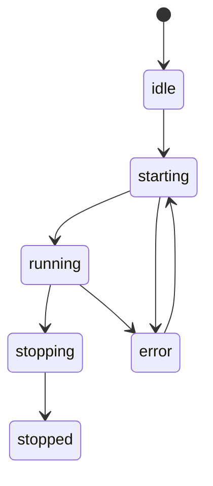
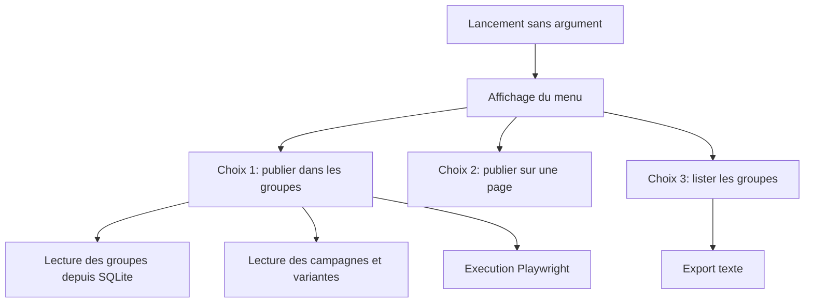

# BON - Modelisation

## 1. Modèle conceptuel

BON manipule les entites suivantes:

- Robot: instance d'execution associee a un compte.
- Account: identite operationnelle.
- Group: groupe Facebook reference par URL.
- Campaign: ensemble de contenus.
- Variant: version textuelle d'une campagne.
- Publication: trace d'une publication.
- Task: element de file.
- Session: execution isolee Playwright.

## 2. Relations principales

- Un account peut etre lie a plusieurs robots dans l'historique, mais un robot represente une execution unique.
- Un robot peut avoir plusieurs groupes associes.
- Un robot peut avoir plusieurs campagnes associees.
- Une campagne contient plusieurs variantes.
- Une publication reference un robot, un groupe et un contenu.

## 3. Etat des sessions

## 4. Flux de demarrage interactif

## 5. Recommandations de modélisation

- Garder les groupes en table relationnelle.
- Garder les variantes en SQL plutot qu'en JSON.
- Versionner les seeds de test si les donnees changent.
- Documenter toute nouvelle table dans ce dossier.

## 6. Nommage

- Les robots suivent un nom stable du type `robot1`, `robot2`.
- Les campagnes gardent un nom explicite.
- Les variantes gardent une cle courte et lisible.
- Les groupes sont identifies par leur URL canonique.

## 7. Traçabilite

Chaque action importante doit pouvoir etre reliee a:

- un robot,
- une campagne,
- une cible groupe,
- et un horodatage.
